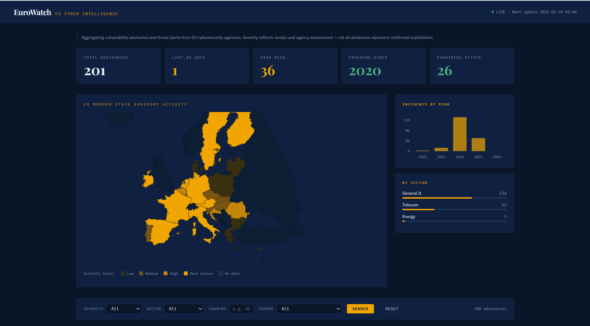

# EuroWatch

**EU Critical Infrastructure Cyber Advisory Monitor**

EuroWatch aggregates, normalizes, and visualizes publicly reported vulnerability advisories and cyber threat alerts from official EU cybersecurity agencies — making scattered, multi-language, multi-source data accessible in one place.



---

## What it does

- Ingests advisories from CERT-EU and the ENISA EU CSIRTs Network (27 EU member states)
- Normalizes everything into a consistent schema: sector, severity, affected countries, CVE IDs
- Serves a filterable REST API and a public intelligence dashboard
- Auto-ingests new advisories every 4 hours via a background scheduler
- Visualizes EU member state advisory activity on an interactive choropleth map

## Data sources

| Source | Type | Coverage |
|--------|------|----------|
| [CERT-EU](https://cert.europa.eu/publications/security-advisories/) | JSON API | EU institutional advisories, 2020–present |
| [ENISA CSIRTs Network](https://github.com/enisaeu/CNW) | GitHub repo | Joint advisories from all 27 EU member state CERTs, 2021–present |

> **Note:** This tool aggregates vulnerability advisories and threat alerts — not all records represent confirmed exploitation. Severity labels reflect vendor and agency assessment.

## Current dataset

- **201 advisories** spanning 2020–2026
- **26 EU countries** represented
- **Zero unclassified** records — all advisories tagged by sector and severity
- Sectors covered: Telecom, General IT, Energy

## Running locally

```bash
# Clone
git clone https://github.com/AnonymousDarkByte/eurowatch
cd eurowatch

# Set up Python environment
python3 -m venv venv
source venv/bin/activate
pip install fastapi uvicorn sqlmodel httpx feedparser apscheduler aiofiles

# Run ingestion (builds the database)
python3 ingest_certeu.py          # CERT-EU RSS (latest 10)
python3 ingest_certeu_full.py     # CERT-EU full archive 2020-present
python3 ingest_cnw.py             # ENISA CSIRTs Network

# Start the API server
uvicorn main:app --reload
```

Then open:
- **Dashboard:** http://127.0.0.1:8000/ui
- **API docs:** http://127.0.0.1:8000/docs
- **Stats:** http://127.0.0.1:8000/stats

## API reference

```
GET /incidents                          All advisories (latest first)
GET /incidents?severity=critical        Filter by severity
GET /incidents?sector=telecom           Filter by sector
GET /incidents?country=DE               Filter by EU member state (ISO code)
GET /incidents?source=CERT_EU           Filter by source
GET /stats                              Aggregated counts by severity, sector, country
POST /ingest                            Manually trigger ingestion
GET /ui                                 Dashboard
```

## Data schema

Each advisory record contains:

| Field | Description |
|-------|-------------|
| `id` | Unique EuroWatch ID (EW-YYYY-XXXXXXXX) |
| `source` | CERT_EU or ENISA_CNW |
| `source_url` | Link to original advisory |
| `date_published` | Publication date |
| `title` | Advisory title |
| `severity` | critical / high / medium / low |
| `sector` | telecom / general-it / energy / health / finance / transport / government |
| `attack_type` | ransomware / apt / ddos / supply-chain / phishing / data-breach |
| `cve_ids` | Comma-separated CVE identifiers |
| `countries` | EU member states that issued their own advisory (ISO codes) |
| `raw_text` | Advisory description text |

## Project structure

```
eurowatch/
├── main.py               FastAPI app, scheduler, API endpoints
├── models.py             SQLModel database schema
├── database.py           SQLite engine and session management
├── classifier.py         Shared keyword-based classification logic
├── ingest_certeu.py      CERT-EU RSS ingestion (latest)
├── ingest_certeu_full.py CERT-EU full archive ingestion
├── ingest_cnw.py         ENISA CSIRTs Network ingestion
├── reclassify.py         Re-run classifier on existing records
├── fix_unclassified.py   Fetch full text and reclassify missing records
└── static/
    └── index.html        Single-file React dashboard (no build step)
```

## Technical notes

**Why keyword classification instead of ML?** Keyword-based classification is transparent, auditable, and doesn't require training data. For a tool aimed at policy researchers and journalists, explainability matters more than marginal accuracy gains.

**Why SQLite?** Sufficient for the current dataset size. Schema is abstracted via SQLModel — switching to PostgreSQL for production deployment requires only a connection string change.

**Geo-blocking note:** Several EU cybersecurity APIs (ENISA EUVD, CISA ICS advisories) are inaccessible from outside the EU. This is documented as a transparency gap — deploying to an EU-based server (e.g. Oracle Cloud Frankfurt) would unlock additional sources.

## Regulatory context

EuroWatch supports transparency goals of the EU NIS2 Directive and the EU Cyber Resilience Act (CRA) by making public incident data more accessible to citizens, researchers, and policymakers.

## Known limitations

- Sector classification is keyword-based and may miss edge cases
- Most CERT-EU advisories are EU-wide (no per-country data) — country data only available for ENISA CSIRTs joint advisories
- Historical data before 2020 not yet ingested
- No confirmed attack reports — this tool tracks advisories, not breach notifications

## License

Apache 2.0 — free to use, modify, and distribute.

---

*Built as a solo student project. Contributions welcome.*
